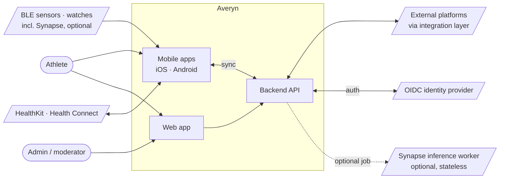
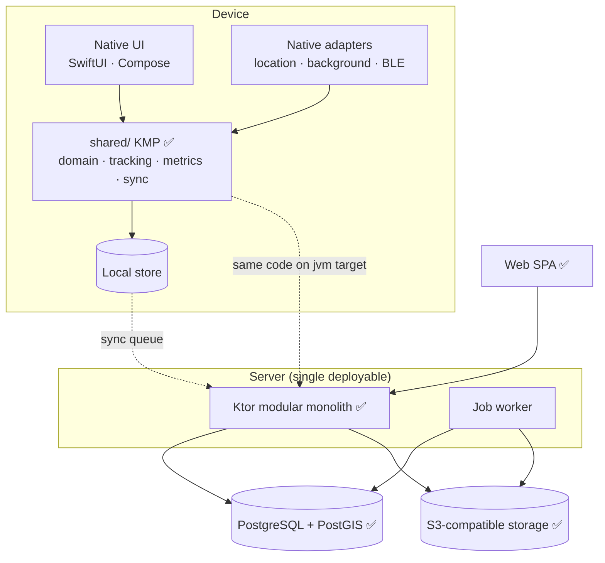

# Architecture overview

Status: v0.1 — target architecture; only the pieces marked ✅ exist in the scaffold.

## System context

## Containers

## Key properties

- **Separation:** acquisition → raw storage → normalization → analysis → sync → presentation → integrations ([report §26](../product/reference-report-v0.1.md)). Raw data is immutable; derived data is versioned.
- **Shared rules:** metrics and validation are one Kotlin implementation used by both device and server ([ADR-0004](../adr/0004-kotlin-multiplatform-shared-native-ui.md)).
- **One deployable server** for both self-hosted and managed cloud ([ADR-0005](../adr/0005-ktor-modular-monolith.md)). This includes any third-party sensor ecosystem: Averyn is the only system of record for users, devices and sessions; a vendor's cloud (e.g. Synapse's) is at most an optional, stateless inference worker Averyn calls, never a second backend ([ADR-0010](../adr/0010-ecosystem-boundary.md)).
- **Identity:** Averyn is an OIDC relying party, not its own identity provider ([ADR-0011](../adr/0011-identity-oidc.md), the default bundled IdP is still to be picked).
- **Sync** is offline-first, idempotent and resumable (design doc to be written at MVP-1 start; requirements in [report §9](../product/reference-report-v0.1.md)).

## Related

[ADRs](../adr/README.md) · [TDD-0001 Tracking Engine](../design/TDD-0001-tracking-engine.md) · [API](../api/openapi.yaml) · [Synapse integration contract](../integrations/synapse.md)
