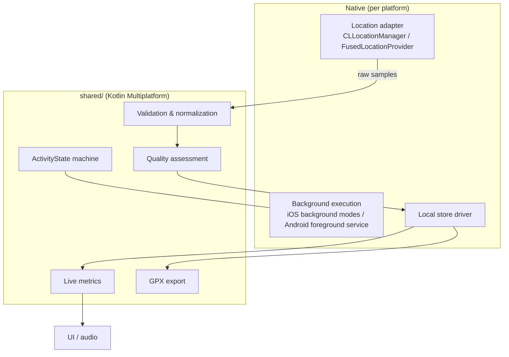
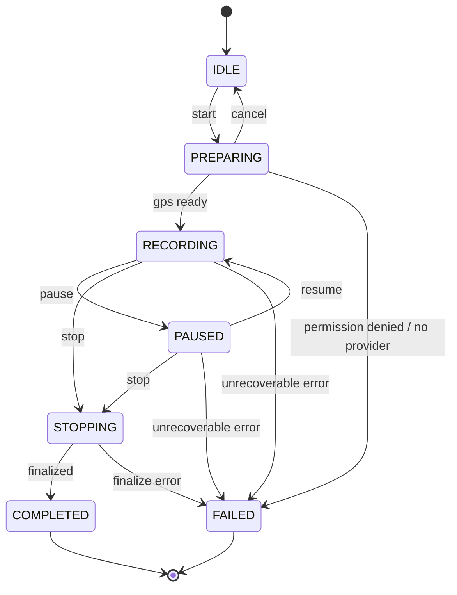

# TDD-0001: Tracking Engine

- **Status:** draft
- **Version:** 0.1
- **Author:** @AlessioBrillo
- **Date:** 2026-09-26
- **Related:** [ADR-0004](../adr/0004-kotlin-multiplatform-shared-native-ui.md), [ADR-0006](../adr/0006-postgres-postgis-s3-storage.md), [report §4.1, §6–9](../product/reference-report-v0.1.md), [device matrix](../testing/device-matrix.md)

## 1. Summary

The tracking engine records an activity from native location services into a durable on-device store, survives app death, and produces live metrics, a quality report and a GPX export. It is the highest-risk component of the product and the subject of **MVP-0**. This document defines the contract; the PoC validates it on real devices.

## 2. Goals and non-goals

**Goals (MVP-0):** GPS recording in foreground/background/screen-locked; pause/resume; incremental local writes; crash/kill/reboot recovery; live distance/time/pace; GPX export; GPS quality diagnostics; measured battery cost.

**Non-goals (MVP-0):** networking and sync, accounts, BLE/HealthKit/Health Connect, watch, maps UI, auto-pause heuristics beyond simple speed threshold, non-GPS sports.

## 3. Functional requirements

| ID | Requirement |
|---|---|
| F1 | Record location samples at a configurable interval while `RECORDING`, in foreground and background, with the screen locked |
| F2 | Pause and resume; total, moving and paused durations are tracked separately |
| F3 | Every accepted sample is durably written locally **before** it is used for live metrics |
| F4 | After process death, crash or reboot, an interrupted activity is detected on next launch and offered for resume or finish; data recorded up to the last durable write is kept |
| F5 | **No silent data loss:** every dropped/filtered sample is counted with a reason; raw samples are never modified or deleted by filtering |
| F6 | Live metrics: elapsed time, moving time, distance, current/average speed and pace |
| F7 | Export a completed (or recovered) activity as valid GPX 1.1 |
| F8 | A quality report per activity (see §5.4) |
| F9 | Permission changes mid-activity (revoked, downgraded to approximate) are detected and surfaced; the activity moves to a defined state, never silently stops |

## 4. Non-functional requirements

- **Durability:** worst-case loss after hard kill ≤ 1 flush interval (target ≤ 5 s / ≤ 5 samples).
- **Battery:** measured per hour of tracking, per device, recorded in the device matrix; budget set after the first measurements (open question Q5).
- **Memory:** bounded; a 10 h activity must not grow memory with duration (samples stream to disk).
- **Privacy:** the engine never sends data anywhere; diagnostics stay on-device unless the user exports them.
- **Determinism:** the same raw samples always produce the same metrics for a given `algorithm_version`.

## 5. Design

### 5.1 Layering

Rule: everything in `shared/` is pure Kotlin and unit-testable on the JVM against fixtures. Native code is thin: it converts platform callbacks to `LocationSample` and drives the state machine.

### 5.2 State machine

States: `IDLE, PREPARING, RECORDING, PAUSED, STOPPING, COMPLETED, FAILED`. Implemented in `shared/domain` (`ActivityState.transition`).

`FAILED` never means "data discarded": a failed activity keeps its durable raw samples and can be exported or recovered.

### 5.3 Sample model (proposal v0)

Canonical `LocationSample` (in `shared/domain`):

| Field | Type | Notes |
|---|---|---|
| `timeMs` | Long | Wall-clock, UTC epoch ms. Can jump (NTP, user change) — never used alone for ordering |
| `elapsedRealtimeMs` | Long | Monotonic since boot (Android `elapsedRealtimeNanos`, iOS system uptime). Used for ordering and duration |
| `latitude`, `longitude` | Double | WGS84 degrees |
| `horizontalAccuracyM` | Double | Platform-reported 1σ/68% radius; ≥ 0 |
| `altitudeM` | Double? | Meters, source (baro/GPS) recorded in metadata later |
| `speedMps` | Double? | Platform-reported; not trusted blindly |
| `bearingDeg` | Double? | 0–360 |

Sensor channels (HR, cadence, power) are separate streams keyed by time, added in MVP-2, so GPS records stay compact.

Supported sports in MVP-0 (Q1, closes the [roadmap open decision](../product/roadmap.md#open-decisions)): **run, ride, walk, hike** — `Sport` enum in `shared/domain`. All four share one sampling policy for MVP-0: **1 s fixed interval, no distance filter**. A per-sport interval (e.g. coarser for hike) is a tuning follow-up once battery numbers exist (§4), not a v0 requirement.

### 5.4 Quality assessment

Per-sample flags (a sample can carry several; raw data is preserved): `POOR_ACCURACY`, `DUPLICATE`, `NON_MONOTONIC_TIME`, `SPEED_OUTLIER`, `JUMP`, `ALTITUDE_SPIKE`. Per-activity report: counts per flag, longest gap, sample-interval distribution, % time with accuracy ≤ 20 m, and a summarized grade (`GOOD/FAIR/POOR`).

**`quality-v1` (Q3 — threshold rules, not Kalman/Savitzky–Golay for v0):** evaluated incrementally against the last *accepted* sample (spec in [`docs/metrics/gps-quality.md`](../metrics/gps-quality.md)):

| Flag | Rule |
|---|---|
| `POOR_ACCURACY` | `horizontalAccuracyM > 30` |
| `DUPLICATE` | same `latitude`/`longitude`/`timeMs` as the last accepted sample |
| `NON_MONOTONIC_TIME` | `elapsedRealtimeMs` does not increase |
| `SPEED_OUTLIER` | implied speed since last accepted sample `> 50 m/s` and leg distance `< 500 m` |
| `JUMP` | implied speed `> 50 m/s` and leg distance `≥ 500 m` (a `SPEED_OUTLIER`-sized jump but too far to be GPS jitter) |
| `ALTITUDE_SPIKE` | implied vertical speed `> 10 m/s` |

Grade: `GOOD` if ≤ 5% of samples flagged and % time accuracy ≤ 20 m is ≥ 90; `POOR` if > 20% flagged or that percentage is < 50; `FAIR` otherwise. Thresholds are constants versioned with `QUALITY_ALGORITHM_VERSION`; retuned only as a new version, from fixtures.

**Diagnostics export (`diagnostics-v1`):** F8's per-activity report — the `QualityReport` above plus sample/loss counts, recovery count, moving/paused time and battery start/end/drain-per-hour — is built by `ActivityRecorder` from counters it already keeps while live or replaying during `recover()`. Both apps show it after an activity completes and export it as JSON (`DiagnosticsReport.toJson`, `shared/tracking`) with a `DeviceInfo` (model/OS/app version, no device identifiers). No coordinates in the export. This is the artifact a tester attaches to a [device matrix](../testing/device-matrix.md) row.

### 5.5 Local persistence and recovery

- Append-only write path: samples are appended to the local store in small batches (flush by count **or** time, whichever first). Activity metadata records `state`, `startedAt`, `lastFlushAt`.
- On launch, any activity whose state is `RECORDING`/`PAUSED`/`STOPPING` without a clean end is **interrupted**: recover, show the user what was kept, let them resume or finish.
- Background execution: iOS uses the location background mode with `allowsBackgroundLocationUpdates` and pause-safe settings; Android uses a foreground service of type `location` with a persistent notification. Vendor battery-killer behavior is documented per device in the matrix.
- **Storage engine (Q2/Q4 — resolved, [ADR-0015](../adr/0015-local-activity-store.md)):** an append-only JSON Lines file per activity, one `SAMPLE` or `EVENT` record per line, written and flushed before the caller can use a sample for live metrics. `ActivityStore` in `shared/tracking` exposes `create`/`appendSample`/`appendEvent`/`forEachRecord` (streaming) /`interrupted`/`list`. A truncated or corrupt trailing line (mid-write kill) is dropped and counted as a loss with reason `TRUNCATED_RECORD` — never guessed at or silently repaired.

### 5.6 Pause semantics

- Manual pause stops sample use for distance/moving time; the engine may keep GPS warm (configurable) to speed up resume.
- Auto-pause (speed below threshold for N s) is a *classification* of time, applied at metric time, not a discarded sample.
- Durations: `total = end − start`, `paused` = sum of paused intervals, `moving = total − paused − stationary`.

## 6. Test strategy

- **Unit (JVM):** state machine (all legal and illegal transitions), metric functions, quality flags — against `tests/gps-fixtures/`.
- **Fixtures** (report §6.4): straight line, tight curves, full pause, resume, intermittent signal, outliers, variable rate, slow/fast movement, noisy altitude, long activity, duplicate/non-monotonic timestamps, missing sensors. Format in [tests/gps-fixtures/README.md](../../tests/gps-fixtures/README.md).
- **Instrumented (real devices):** background, lock screen, force-kill, reboot, permission change, low battery, network loss — logged in the [device matrix](../testing/device-matrix.md). Emulators are not sufficient for this component.
- **Battery:** ≥ 1 h controlled runs per device, same route/conditions, recorded in the matrix.

## 7. Rollout

PoC apps are internal builds (Android debug APK, iOS via a personal dev team). No user data leaves the device in MVP-0.

## 8. Risks and mitigations

| Risk | Mitigation |
|---|---|
| OEM battery optimizations kill Android service | Foreground service + guidance flow; per-vendor results in the matrix |
| iOS suspends/terminates the app | Correct background mode + significant-change/relaunch handling; recovery is a first-class flow |
| KMP↔Swift interop friction on hot path | Keep hot path in native adapter → shared calls coarse-grained (batches); measure |
| Filtering hides real data | Filtering only flags; raw always stored; export can choose raw or cleaned |
| Can't test iOS locally (Windows dev machine) | macOS CI runner + real iPhone via Xcode when available; tracked as a project risk |

## 9. Open questions

| # | Question | Produces | Status |
|---|---|---|---|
| Q1 | Sampling interval and distance filter per sport | ADR + constants | **Resolved** — §5.3: 1 s / no filter, all MVP-0 sports |
| Q2 | Local DB: SQLDelight (shared) vs. platform-native (Room / GRDB) | ADR | **Resolved** — [ADR-0015](../adr/0015-local-activity-store.md): neither, append-only file |
| Q3 | Filtering algorithm (threshold rules vs. Kalman/Savitzky–Golay) and thresholds | Metric spec + ADR | **Resolved** — §5.4, [`docs/metrics/gps-quality.md`](../metrics/gps-quality.md): threshold rules, `quality-v1` |
| Q4 | On-disk/raw-blob sample encoding (also used for sync upload) | ADR | **Resolved** — [ADR-0015](../adr/0015-local-activity-store.md): JSON Lines |
| Q5 | Battery budget per hour by sport | Number in this doc | Open — `batteryDrainPercentPerHour` is now measured per activity (`diagnostics-v1`, §5.4); still needs enough real-device runs logged in the [device matrix](../testing/device-matrix.md) to set a budget number here |
| Q6 | Altitude source policy (GPS vs. barometer vs. DEM correction) | ADR | Open — deferred; MVP-0 uses the platform-reported `altitudeM` as-is |
