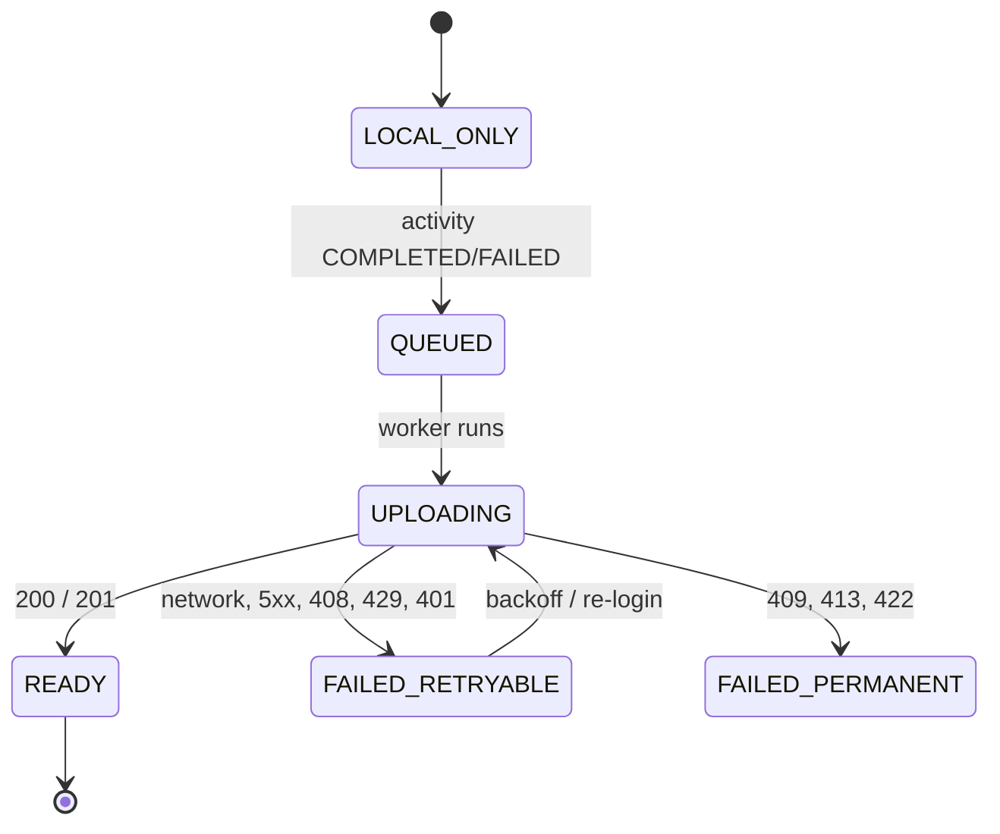

# TDD-0002: Activity Sync

- **Status:** draft
- **Version:** 0.1
- **Author:** @AlessioBrillo
- **Date:** 2026-10-02
- **Related:** [TDD-0001](TDD-0001-tracking-engine.md), [ADR-0006](../adr/0006-postgres-postgis-s3-storage.md), [ADR-0011](../adr/0011-identity-oidc.md), [ADR-0015](../adr/0015-local-activity-store.md), [ADR-0016](../adr/0016-server-raw-activity-storage.md), [threat model](../privacy/threat-model.md), [report §9](../product/reference-report-v0.1.md)

## 1. Summary

A completed activity recorded offline on a device is uploaded to the backend as its raw JSON Lines file ([ADR-0015](../adr/0015-local-activity-store.md)), stored immutably in object storage, replayed server-side with the same `shared/` code the device uses, and summarised in PostgreSQL. The upload is a single idempotent `PUT`; retries are safe. This is the critical path of **MVP-1**.

## 2. Goals and non-goals

**Goals:** offline-first, idempotent, resumable-by-retry upload of completed activities; per-user ownership; device and server computing identical metrics from identical bytes.

**Non-goals (v1):** gzip and chunked upload; activity list and web UI; account deletion and export; editing metadata or visibility after upload; a `jobs` table or background worker; upload via a background `URLSession`; passkey/MFA (decided with the IdP, [ADR-0011](../adr/0011-identity-oidc.md)).

## 3. Functional requirements

| ID | Requirement |
|---|---|
| S1 | Only activities whose last state is `COMPLETED` or `FAILED` are uploaded: the file is then immutable |
| S2 | Uploading the same bytes twice yields one activity (idempotent); a retry after any failure is always safe |
| S3 | The server never trusts client-computed metrics: it recomputes them from the raw file |
| S4 | The raw file is stored byte-for-byte; nothing in it is modified, filtered or dropped server-side |
| S5 | An activity is visible only to its owner; others get `404`, never `403` |
| S6 | Sync state survives app death and reboot, and is visible to the user |
| S7 | Every rejected or unreadable record is counted with a reason, as in [TDD-0001 F5](TDD-0001-tracking-engine.md) |

## 4. Non-functional requirements

- **Size:** body limit 32 MB (3 h at 1 Hz ≈ 2 MB; 10 h ≈ 7 MB).
- **Privacy:** coordinates and tokens never appear in logs; log ids, counts and hashes only ([data classification](../privacy/data-classification.md)). Activities are `private` by default.
- **Determinism:** same bytes → same metrics for a given `algorithm_version`.
- **Self-hosting:** no new infrastructure beyond what Compose already runs, plus the IdP ([ADR-0011](../adr/0011-identity-oidc.md)).

## 5. Design

### 5.1 Endpoint

`PUT /v1/activities/{clientActivityId}` — `clientActivityId` is the activity's UUID (iOS generates it upper-case, Android lower-case; the server normalises to lower-case).

- Body: `application/x-ndjson`, the `.jsonl` file as stored on the device. Header `Authorization: Bearer <OIDC access token>`.
- The server streams the body to a temporary file, enforcing the limit and computing SHA-256 on the fly.

| Condition | Response |
|---|---|
| New `(owner, clientActivityId)` | `201`, stored and summarised |
| Exists, same SHA-256 | `200`, same resource (idempotent retry) |
| Exists, different SHA-256 | `409` |
| Not parseable, no `META` line, or last state not terminal | `422` |
| Missing or invalid token | `401` |
| Body over the limit (checked while streaming, also without a `Content-Length`) | `413` |
| Malformed id in the URL | `400` |
| All upload slots busy (at most 8 uploads are processed at once) | `503` + `Retry-After` (retryable) |

Also: `GET /v1/activities/{id}` (owner only, `404` otherwise) and `GET /v1/client-config` (public: `{issuer, clientId}`, so a mobile app needs only the server URL).

### 5.2 Server ordering

1. Receive, hash, check idempotency.
2. Replay the file with `shared/tracking` (read-only, see §5.4) to get state, metrics, quality and loss counts.
3. `PUT` the raw object to S3 at the key `raw/{ownerId}/{clientActivityId}/{sha256}.jsonl`.
4. `INSERT` the `activities` row (`ON CONFLICT (owner, client id) DO NOTHING`); if another upload won the race, answer as in step 1.

If step 4 fails, an orphan object remains; the retry writes the same key with identical bytes. A database row never exists without its raw object. The hash is in the key so that two concurrent uploads of one id with different bytes can never overwrite each other's object.

A line that parses but violates the sample model (e.g. latitude 123) makes the whole upload `422`: the server never stores a file it cannot replay. Metrics of a `FAILED` activity are finished at its last event (an open pause is closed there), like a `COMPLETED` one.

### 5.3 Client state machine

`UPLOADED` and `PROCESSING` ([report §9.1](../product/reference-report-v0.1.md)) are not needed because processing is synchronous. A `401` is `FAILED_RETRYABLE` with reason `AUTH` (the user must sign in again). `FAILED_PERMANENT` keeps the HTTP code. State lives in `<id>.sync.json` next to the `.jsonl`, written to a temp file and atomically renamed; the ADR-0015 store is not modified.

### 5.4 Shared code

The recovery loop in `ActivityRecorder.recover()` is extracted into a read-only `replay(store, activityId)` in `shared/tracking`. `recover()` calls it and then logs its `RECOVERED` event; the server calls only `replay`, so it never writes to the file. The backend depends on `:shared:tracking` (jvm target).

### 5.5 Data model

`activities` (Flyway `V3`): owner, `client_activity_id` (unique per owner), sport, `started_at`, `final_state`, raw object key / SHA-256 / size, `distance_m`, `elapsed_ms`, `moving_ms`, `paused_ms`, quality grade, `dropped_records` (lines the store could not read, F5), `metrics_algorithm_version` (`distance-v1,time-v1,speed-v1`), `quality_algorithm_version`, `track geometry(LineString, 4326)` (the samples that counted towards the distance, in order, i.e. recorded while `RECORDING` and not duplicate / out of order / a jump; `NULL` if fewer than 2), `visibility` default `private`. `users` (`V2`) is keyed by `(oidc_issuer, oidc_subject)`.

### 5.6 Conflicts ([report §9.1](../product/reference-report-v0.1.md))

| Case | v1 behaviour |
|---|---|
| Same activity uploaded twice | idempotent `200` |
| Same id, different bytes | `409`, permanent; the first upload wins |
| Concurrent deletion | out of scope (no deletion yet) |
| Same file imported twice | out of scope (import is MVP-2) |
| Privacy / metadata change | out of scope (immutable after upload) |
| Schema version change | the `META` line and unknown-key tolerance of ADR-0015; new format = new version |

### 5.7 Platform notes

Android: `WorkManager` with a network constraint and exponential backoff. iOS: `BGProcessingTask`, also run on foreground and at the end of an activity. The Ktor Darwin engine does not use a background `URLSession`, so the upload must fit in the BG task's time; fine for ~2 MB, revisit for longer activities.

## 6. Test strategy

- **`shared/tracking` (JVM):** for each fixture, `replay` and `recover` agree on metrics, and `replay` leaves the file byte-identical.
- **`shared/sync` (JVM, `MockEngine`):** each response class maps to the right state; `RECORDING` activities are never uploaded; `READY` ones are not re-uploaded; the body equals the file byte-for-byte.
- **Backend (Testcontainers: PostGIS + SeaweedFS):** 201 / 200 / 409 / 422 / 413 / 401, metrics equal to `expected.json`, and an **IDOR** test (user B reads user A's activity → 404). Auth tests use a generated RSA key and a stub JWKS.
- **Real device:** record, go offline, reconnect, confirm `READY` and one DB row; kill the app mid-upload and confirm a clean retry.

## 7. Rollout and migration

New tables via forward-only Flyway migrations. Existing local activities on test devices upload on first sync. The Compose stack gains the IdP and S3 variables.

## 8. Risks and mitigations

| Risk | Mitigation |
|---|---|
| IdP issuer URL differs between phone and backend (`iss` mismatch) | One public URL, documented in [self-hosting](../deployment/self-hosting.md); the IdP spike checks it first |
| Server and device compute different metrics | One implementation (`shared/`), same fixtures on both |
| Body read fully in memory on large activities | Server streams to disk; the client reads the file whole (`ponytail`: fine to ~7 MB, stream if needed) |
| iOS BG task killed mid-upload | The `PUT` is idempotent; the next run retries from scratch |
| Token expires during a long offline period | Refresh with AppAuth; on failure `FAILED_RETRYABLE/AUTH` and a prompt to sign in |
| The dev stack is plain HTTP | Debug-only cleartext on Android; iOS PoC builds set `NSAllowsArbitraryLoads` (internal builds only, TDD-0001 §7). Both go away with a TLS example in the self-hosting guide, before any store distribution |

## 9. Open questions

| # | Question | Produces |
|---|---|---|
| Q1 | Default bundled IdP (spike with measured criteria) | ADR-0011 → `accepted` |
| Q2 | When do gzip/chunking become necessary (measured on real networks)? | additive header, no ADR |
| Q3 | Retention and deletion of raw objects | ADR, before any public instance |
