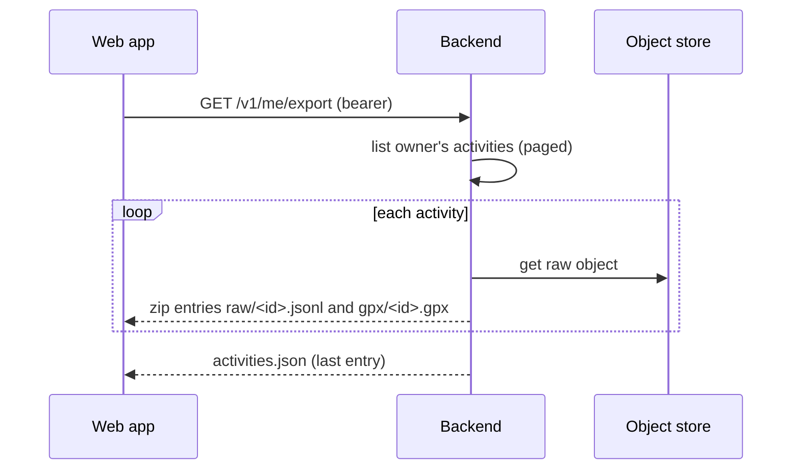

# TDD-0004: Data Deletion and Export

- **Status:** draft
- **Version:** 0.1
- **Author:** @AlessioBrillo
- **Date:** 2026-10-07
- **Related:** [ADR-0017](../adr/0017-data-deletion-and-retention.md), [ADR-0016](../adr/0016-server-raw-activity-storage.md), [TDD-0002](TDD-0002-activity-sync.md), [TDD-0003](TDD-0003-web-activity-view.md), [data classification](../privacy/data-classification.md), [threat model](../privacy/threat-model.md)

## 1. Summary

A signed-in user can delete one activity, delete their account's data, and download everything they have stored, in open formats. This is the last privacy gate before any public instance (TDD-0002 Q3) and closes the MVP-1 data-handling rules.

## 2. Goals and non-goals

**Goals:** delete an activity (row + raw object); delete the account's Averyn data; export all data as one archive; a deleted activity is not resurrected by a device retry; usable from the web app.

**Non-goals (v1):** undo or a grace period; deleting the identity in the IdP; asynchronous export jobs; scheduled purges; export from the mobile apps; a deletion audit log; editing or hiding activities.

## 3. Functional requirements

| ID | Requirement |
|---|---|
| D1 | `DELETE /v1/activities/{id}` removes the raw object and the row; a non-owner gets `404` (as S5), also when deleting |
| D2 | A later `PUT` of a deleted `clientActivityId` by the same owner answers `410`; the tombstone contains no activity data |
| D3 | `DELETE /v1/me` removes every object under the owner's prefix, all activities and tombstones, and marks the user deleted; it is idempotent and is the only call a deleted account may still make |
| D4 | Any other call by a deleted account answers `403` |
| D5 | `GET /v1/me/export` returns a ZIP: `activities.json` (summaries, the dropped-line counts), `raw/<clientActivityId>.jsonl` byte-for-byte, `gpx/<clientActivityId>.gpx` |
| D6 | Export and deletion never log coordinates or tokens; a corrupt line skipped by the GPX writer is counted in `activities.json`, not silently dropped (TDD-0001 F5) |

## 4. Non-functional requirements

- **Reliability:** deletion is retryable at every step; a half-done deletion never leaves a Restricted object without a row that points at it (activity) or leaves the account usable (account).
- **Resources:** export streams entry by entry (one raw file in memory at most, 32 MB cap); at most 2 exports run at once, the rest get `503` + `Retry-After`.
- **Self-hosting:** no new service; one migration.
- **Size (to measure):** about 1000 activities of 3 h is roughly 2 GB of raw files; acceptable for pre-alpha, revisit with real data.

## 5. Design

### 5.1 Data model (migration `V5`)

```sql
ALTER TABLE users ADD COLUMN deleted_at timestamptz;
CREATE TABLE deleted_activities (
    owner_id           uuid NOT NULL REFERENCES users (id),
    client_activity_id uuid NOT NULL,
    deleted_at         timestamptz NOT NULL DEFAULT now(),
    PRIMARY KEY (owner_id, client_activity_id)
);
```

### 5.2 Order of operations

| Operation | Steps |
|---|---|
| Delete activity | find the row by `(owner, id)` → delete the object → in one transaction delete the row and insert the tombstone (`ON CONFLICT DO NOTHING`). Failure after step 2 leaves a row without a file; repeating the call completes it. |
| Delete account | set `users.deleted_at` first (new requests stop at once, D4) → delete all objects under `raw/{ownerId}/` (listing is paged; also removes orphans of failed ingests) → in one transaction delete activities and tombstones. A crash leaves a deleted but not yet purged account; repeating `DELETE /v1/me` finishes. |
| Upload | the tombstone check comes before the "already uploaded" check. An upload racing with an account deletion can leave one orphan object under the prefix; the repeated `DELETE /v1/me` removes it. |

### 5.3 Export



The GPX is produced with the same shared writer the apps use (`ActivityStore.exportGpxToFile`), from the raw file written to a temporary directory that is removed afterwards. `activities.json` is the last entry because it carries the per-activity skipped-line counts, known only after the GPX is written. The browser downloads it with a `fetch` carrying the bearer token (a plain link cannot).

### 5.4 Web

Detail page: "Delete" (browser confirmation, then back to the list). New "Account" area: "Download my data"; "Delete account" requiring the word `delete`, then signing out, with a note that the identity at the identity provider must be closed there.

## 6. Test strategy

Backend integration tests (real PostGIS and object store, as TDD-0002): delete then `GET`/track `404`, object gone, re-`PUT` `410`; another user's delete `404` and their row untouched; account deletion leaves no object under the prefix, every other call `403`, a second `DELETE /v1/me` `204`, other users untouched; export zip has the right entries, raw bytes hash to `raw_sha256`, GPX parses, concurrent-export limit. Log capture shows no coordinates or tokens. Web: Vitest for the confirmation logic; a real-browser run of the full flow before merge.

## 7. Rollout and migration

`V5` is additive. The OpenAPI file, data classification, threat model and self-hosting guide are updated in the same slice.

## 8. Risks and mitigations

| Risk | Mitigation |
|---|---|
| Object-store failure mid-delete | order of operations above; the call is retryable |
| Large export ties up the server | streaming, 2 at once, `503` beyond |
| Backups hold deleted data | operator retention, documented; ADR-0017 |
| Deleted user cannot come back with the same identity | documented operator action; accepted in ADR-0017 |

## 9. Open questions

| # | Question | Resolution path |
|---|---|---|
| Q1 | Export size limits and a switch to asynchronous jobs | measured on real data; additive |
| Q2 | Export from the mobile apps (they hold the originals) | with the next app slice |
| Q3 | Legal retention and a deletion audit trail for a hosted service | with the DPIA, before a public hosted service |
