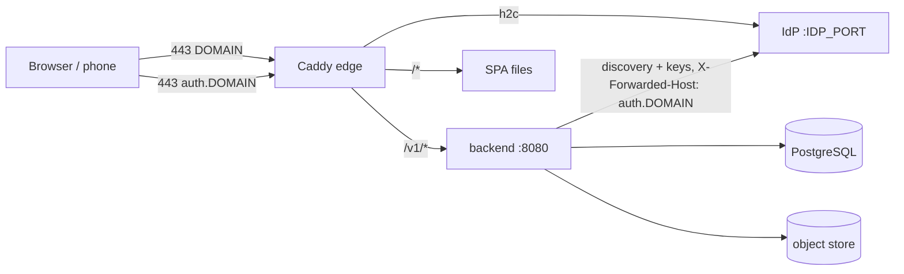

# TDD-0005: Self-Host Hardening

- **Status:** draft
- **Version:** 0.1
- **Author:** @AlessioBrillo
- **Date:** 2026-10-10
- **Related:** [ADR-0018](../adr/0018-tls-edge-and-public-issuer.md), [ADR-0011](../adr/0011-identity-oidc.md), [ADR-0017](../adr/0017-data-deletion-and-retention.md), [TDD-0002](TDD-0002-activity-sync.md), [TDD-0003](TDD-0003-web-activity-view.md), [threat model](../privacy/threat-model.md), [self-hosting](../deployment/self-hosting.md)

## 1. Summary

Make the Compose stack fit to run where others can reach it: TLS at one edge, a Content-Security-Policy on the web app, per-user rate limit and storage quota, health checks, generated secrets, and backup/restore/upgrade runbooks. This closes the MVP-1 exit criterion "self-host via Compose works from a clean machine" and the threat-model items marked "before any public instance".

## 2. Goals and non-goals

**Goals:** HTTPS for the web app, the API and the IdP with automatic certificates; the backend keeps verifying the public issuer; a CSP that blocks injected script from reading the session token; one user cannot exhaust request capacity or storage; a fresh machine reaches a working instance with one script and one command; documented and once-tested backup, restore and upgrade.

**Non-goals (v1):** migrating an existing HTTP instance to TLS or to another domain (ADR-0018); encryption at rest of PostgreSQL and object storage (Q2); a backend-for-frontend session (TDD-0003 Q2, Q1 here); more than one backend replica; per-IP limits for unauthenticated endpoints; automated backups; fair-use quota tiers (business model, MVP-3).

## 3. Functional requirements

| ID | Requirement |
|---|---|
| H1 | In TLS mode only the edge publishes ports: 80 redirects to 443; `DOMAIN` serves the SPA and `/v1`, `auth.DOMAIN` the IdP; `/metrics` is never proxied |
| H2 | The issuer is `https://auth.DOMAIN`; the backend reads discovery and keys from `AVERYN_OIDC_INTERNAL_URL` and still requires the document's `issuer` to equal the configured one |
| H3 | Every web response carries the CSP in §5.3 and the other security headers; the web app works with it without console violations |
| H4 | An authenticated user over the request limit gets `429` with `Retry-After`; other users are unaffected |
| H5 | An upload that would take a user over the storage quota gets `507` and stores nothing; repeating an already stored upload still answers `200` |
| H6 | Every long-running service has a health check; services start only after their dependencies are healthy |
| H7 | A script creates `.env` and the object-store identity with random secrets and refuses to overwrite an existing `.env` |
| H8 | Neither the edge nor the backend logs coordinates, tokens or request URLs carrying ids beyond what ADR-0009 allows (W3 unchanged) |

## 4. Non-functional requirements

- **Security:** HSTS on `DOMAIN` (one year, no `includeSubDomains`: the operator's other hosts are not ours to decide). Release apps stay HTTPS-only; iOS drops the blanket ATS exception outside Debug.
- **Resources:** the rate limiter keeps one token bucket per active user in memory (single node). The quota check is one indexed sum per upload.
- **Self-hosting:** no new service; one new Caddy volume in TLS mode; two DNS names. The plain-HTTP development stack stays the default.
- **Compatibility:** the apps need no change: their sync already treats `429` and `5xx` as retryable (`ActivitySync`), so a user over quota syncs again once they free space.

## 5. Design

### 5.1 Topology (TLS overlay)



`docker-compose.tls.yml` overrides: the IdP's TLS mode and external settings, removes the published ports of the IdP and backend, gives the edge 80/443 and a certificate volume, and passes the https issuer and web origin to `idp-init`. `idp-init` registers redirect URIs from those values and turns `devMode` off when the issuer is https; it updates the existing apps too, so a rerun converges.

### 5.2 Internal discovery

```text
issuer        = https://auth.DOMAIN            (configured, compared exactly)
internal URL  = http://idp:8081                (AVERYN_OIDC_INTERNAL_URL)
GET {internal}/.well-known/openid-configuration   X-Forwarded-Host: auth.DOMAIN
  → issuer must equal the configured issuer
  → jwks_uri https://auth.DOMAIN/oauth/v2/keys  → rewritten to http://idp:8081/oauth/v2/keys
```

Key fetches go to the rewritten URL with the same header. Without an internal URL the backend behaves as before.

### 5.3 Content-Security-Policy

One Caddy snippet shared by the HTTP and TLS configurations; the two origins come from the environment because they are deployment configuration.

| Directive | Value | Why |
|---|---|---|
| `default-src` | `'none'` | deny by default |
| `script-src` | `'self'` | the build has no inline script; blocks injected script, the main risk to the token in `sessionStorage` |
| `style-src` | `'self'` | bundled CSS; element styles set from script use the CSSOM, which CSP does not restrict |
| `img-src` | `'self' data: blob:` | map sprites and decoded images |
| `font-src` | `'self'` | |
| `worker-src` | `'self' blob:` | MapLibre's worker (same-origin file; blob as its fallback) |
| `connect-src` | `'self' ${AVERYN_IDP_ORIGIN} ${AVERYN_MAP_ORIGINS}` | API; the OIDC library's discovery and token calls; style, tiles, glyphs |
| `form-action` | `'self'` | |
| `base-uri` | `'none'` | |
| `frame-ancestors` | `'none'` | no framing (clickjacking) |

Sign-in and sign-out are top-level navigations to the IdP, which CSP does not restrict. Also sent: `X-Content-Type-Options: nosniff`, `Referrer-Policy: no-referrer` (both already sent), and `Permissions-Policy: camera=(), microphone=(), geolocation=()`.

### 5.4 Rate limit

Ktor's `RateLimit` plugin, one token bucket per JWT `sub`, applied to every authenticated `/v1` route: `AVERYN_RATE_LIMIT_PER_MINUTE` requests per minute (default 120). Over the limit: `429` with `Retry-After`. `/v1/client-config`, `/health`, `/ready` are not limited. The existing global bounds (8 uploads, 2 exports at once) stay: they protect the process, the bucket protects other users.

### 5.5 Storage quota

`AVERYN_USER_QUOTA_BYTES` (default 1 GiB, about 30 maximum-size files, many more real ones). After the tombstone and "already uploaded" checks, before the file is replayed or written:

```sql
SELECT coalesce(sum(raw_size_bytes), 0) FROM activities WHERE owner_id = :owner;
-- used + this file > quota  →  507, nothing stored
```

The check is not serialized with the insert: one user's concurrent uploads can overshoot by at most the number of upload slots (8) times the file limit. Locking the user row instead would hold a pooled connection for the whole object-store write; accepted for a single node, revisit if the quota must be exact.

Only raw files count: they are the data the user owns and can delete (ADR-0017). `507` rather than `413` because the request is valid and becomes acceptable after the user frees space, and the apps already retry `5xx`.

### 5.6 Operations

Health checks: object store and edge with `wget`, IdP with its own `ready` command, backend on `/ready`. `init-env.sh` writes `.env` and a git-ignored object-store identity file with the same keys. Runbooks: backup (both databases, the object-store volume, the IdP bootstrap and OIDC volumes, the certificate volume, `.env`), restore onto fresh volumes, upgrade (backup, pull, rebuild, migrations at start, rollback = restore).

## 6. Test strategy

| What | How |
|---|---|
| Internal discovery | backend auth test: the test issuer served at a different internal URL; token accepted; wrong `issuer` in the document rejected |
| Rate limit | backend test: limit + 1 requests → `429` + `Retry-After`; a second user still `200` |
| Quota | integration test (real PostGIS and object store): over quota → `507`, no row, no object; re-`PUT` of a stored id with a full quota → `200` |
| HTTP stack | CI Compose job: generated `.env`, all services healthy, existing checks, CSP header present |
| TLS stack | CI job with the overlay on `averyn.localhost`: Caddy's local root CA, discovery issuer `https://auth.averyn.localhost`, same issuer in client config, `/v1` `401`, `/metrics` not proxied, 80 → 443, HSTS |
| Browser | real-browser run before merge (both stacks): sign-in, list, detail with map, export, no CSP violations |
| Runbooks | one manual backup → `down -v` → restore → sign-in, activities visible |
| iOS | CI: the Release build's Info.plist has no ATS exception |

## 7. Rollout and migration

No database migration. The HTTP stack keeps working as before; existing `.env` files keep working (new variables have defaults). TLS is for new instances only (ADR-0018). The OpenAPI file, threat model, self-hosting guide and runbooks are updated in the same slice.

## 8. Risks and mitigations

| Risk | Mitigation |
|---|---|
| The IdP stops selecting its instance from `X-Forwarded-Host` after an upgrade | TLS CI job checks discovery through the backend path; pinned IdP version |
| The CSP breaks the map or sign-in (e.g. a style host not listed) | origins are configuration; browser run before merge; violations show in the console |
| A domain chosen at first start cannot be changed | documented as a first-start decision; ADR-0018 |
| In-memory buckets reset on restart | acceptable: a restart costs a user at most one extra minute of requests |
| Restore brings back data deleted after the backup | the restore runbook asks the operator to repeat deletions (ADR-0017) |

## 9. Open questions

| # | Question | Resolution path |
|---|---|---|
| Q1 | Backend-for-frontend session instead of a token in `sessionStorage` (TDD-0003 Q2) | ADR before a public hosted service; the CSP lowers the risk meanwhile |
| Q2 | Encryption at rest for Restricted data (data classification) | volume/disk encryption documented by the operator now; ADR before a hosted service |
| Q3 | Quota and rate-limit thresholds | from real usage, with the fair-use tiers ([business model](../product/business-model.md)) |
| Q4 | Migrating an HTTP instance to TLS | a runbook when an operator needs it (ADR-0018) |
